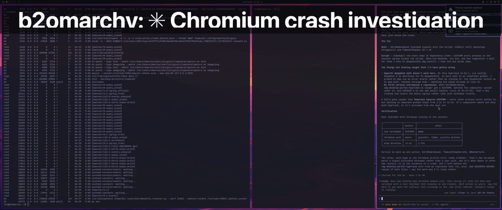

# dmswitch

Two machines, one monitor. Swipe to a macOS Space and the monitor switches its
input to the Linux box while your Mac's keyboard and trackpad start driving it.
Swipe back and everything returns.


Mission Control on the shared monitor. The first two are ordinary macOS Spaces;
the rest are one Space per Hyprland workspace on the Linux box, named after the
window that workspace is showing. The thumbnails are live screenshots of that
machine, so Mission Control shows you both computers at once.



One of those Spaces full-screen: a title bar naming the remote window, over
that workspace as it last looked. Swipe in and the monitor changes input while
your keyboard and trackpad start driving the Linux machine — swipe out and it
all comes back.

## How it fits together

```
   Mac (macOS)                                  Linux box (Hyprland)
   ┌──────────────────────────┐   TCP :24810    ┌──────────────────────────┐
   │ dmswitch                 │  EVT: events    │ dmswitch_receiver.py     │
   │  ├─ a Space per remote   │ ──────────────► │  ├─ held-key watchdog    │
   │  │   workspace           │                 │  ├─ relays to ydotoold   │
   │  ├─ CGEventTap capture   │  CTL: json      │  └─ hyprctl workspaces   │
   │  └─ betterdisplaycli     │ ◄──────────────►│            ▼             │
   └───────────┬──────────────┘                 │      /dev/uinput         │
               │ DDC                            └──────────────────────────┘
               ▼
        shared monitor  ── input 1: Mac · input 2: Linux box
```

The two machines' desktops sit in one continuous strip, so the swipe you
already use to change Space is the whole interface:

```
[mac 1] [mac 2] … [mac last] │ [ws1] [ws2] [ws3]
                             ↑ swipe left from ws1 lands back on the Mac
```

## ⚠️ Read this before running it

**The receiver is an unauthenticated remote input service.** Anyone who can
reach its port can:

- **inject arbitrary keystrokes** into the Linux desktop — in practice, remote
  code execution, since they can type into a terminal
- **capture the screen** of the shared monitor and read it back

There is **no authentication and no encryption**. Every keystroke you forward —
including passwords typed on the Linux box — and every screenshot crosses the
network in clear text. The receiver installs as an enabled systemd unit, so it
comes back after a reboot.

It defaults to binding **all interfaces**, which on an untrusted network means
anyone on that network. Only run this on a trusted private link, and prefer
binding a single address:

```bash
dmswitch_receiver.py --host 100.x.y.z    # e.g. only your VPN address
```

On the Mac side the app is, by construction, a **system-wide keylogger**: it
needs Accessibility and Input Monitoring in order to capture and suppress
input, which means it can see everything you type on that machine too.

If that trade is not one you want to make, this tool is not for you.

## Requirements

**Hardware**

- A monitor with **two inputs** and working **DDC/CI input switching**, one
  cable from each machine. Not all monitors honour DDC input select.
- A **second display on the Mac** is strongly recommended: moving the pointer
  there is how you hand input back without leaving the Space.

**Mac**

- macOS 13+, Python 3.11+, [`uv`](https://docs.astral.sh/uv/)
- [BetterDisplay](https://github.com/waydabber/BetterDisplay) installed **and
  running** — `betterdisplaycli` only messages the running app. DDC control is
  a paid-tier feature.
- Accessibility **and** Input Monitoring permission

**Linux**

- **Hyprland** — this drives `hyprctl` directly and is not portable to other
  compositors as written
- `ydotool` (input injection), `grim` (Space thumbnails), Python 3
- Your user in the `input` group

Hyprland 0.56+ with the Lua config parser is what this was developed against;
older builds use the classic dispatcher syntax, which the receiver falls back
to. See [learnings.d/hyprland-lua-api.md](learnings.d/hyprland-lua-api.md).

## Install

See **[QuickStart.md](QuickStart.md)**. In short:

```bash
git clone https://github.com/b2ornot2b/desktop-monitor-switch
cd desktop-monitor-switch

# Linux box: installs the receiver and two systemd user units
scp -r linux you@linux-box:~/dmswitch-install
ssh you@linux-box '~/dmswitch-install/install.sh HDMI-A-1'

# Mac
uv venv && uv pip install -e ".[dev]"
.venv/bin/python -m dmswitch --check
.venv/bin/python -m dmswitch --no-forward --no-monitor-switch   # safe first run
```

`--no-forward` cannot take over your keyboard, which makes it the right way to
try it the first time.

Defaults assume nothing about your hardware except that you will set
`~/.config/dmswitch/config.json` — monitor id, DDC values, host, and the size of
your shared display. See [docs/configuration.md](docs/configuration.md).

## Getting your keyboard back

Handing over your only keyboard deserves more than one way out:

| | |
|---|---|
| Move the pointer to your other display | input returns to the Mac; the monitor stays as it is |
| Swipe left off the front of the strip | releases both monitor and input |
| `Ctrl+Opt+Cmd+Esc` | panic: releases everything immediately |
| `Cmd+Q`, or `Ctrl+C` in the launching terminal | quit |
| `pkill -f dmswitch` from another machine or SSH | last resort |

Gesture events are never captured, so swiping always works even if something
else has gone wrong. Both ends track held keys and release them if the
connection drops, so the Linux box is never left with a stuck modifier it has
no keyboard to clear.

## Documentation

| | |
|---|---|
| [QuickStart.md](QuickStart.md) | get it running, and how to stop it |
| [docs/](docs/) | architecture, protocol, configuration, operations, troubleshooting |
| [learnings.md](learnings.md) | what this cost to find out, so it only costs it once |

The learnings are the part worth reading even if you never run this: silent
failures across four layers, macOS event taps and Spaces, PyObjC, Hyprland's
Lua API, and why the obvious off-the-shelf tool does not work.

## Status

A personal tool, shared in case it is useful. It works reliably on the setup it
was built for and has 74 tests covering the parts that can be tested without
hardware, but it has been run on exactly one pair of machines. Expect to adjust
things. Issues and PRs welcome.

## License

MIT — see [LICENSE](LICENSE).
